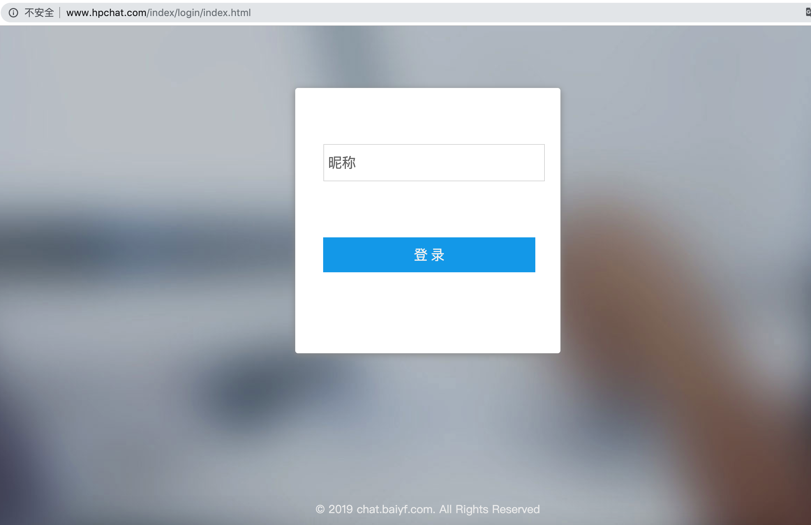
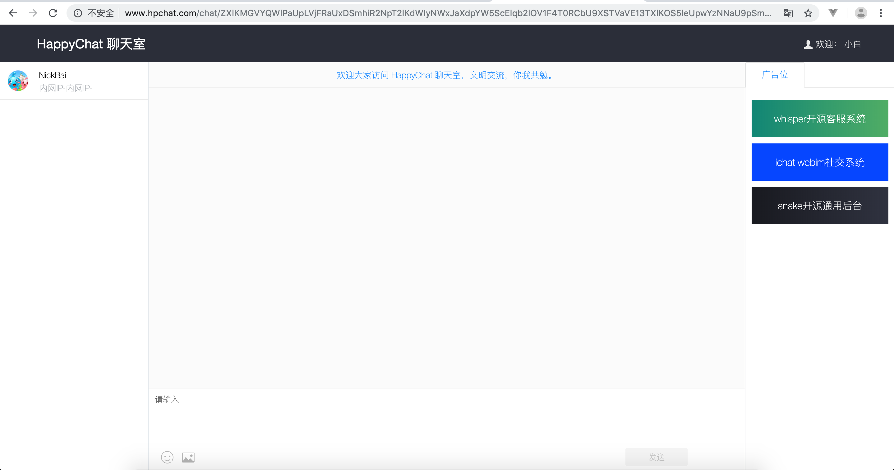

# HappyChat

happychat 全新大升级，旧版本请到 release 中下载。

## 体验地址  
http://hpchat.baiyf.com  

## 如何使用
### 1、推荐配置

php  7.0+  
mysql 5.6+  
nginx 1.4+  
操作系统 linux or macos

### 2、相关的扩展  

1、pcntl (linux下开进程用)   
2、event (增强性能用)  

>其余php常见的扩展 mysql pdo 之类的就不列举了  

### 3、获取源码  
```php
git clone https://github.com/nick-bai/HappyChat.git
cd HappyChat
composer update
```

### 4、搭建 thinkphp 5.1 项目  
> 这个教程有很多，可以参考我的 教程 http://doc.baiyf.com/988777 

特别强调2点！   
1、根目录在 public  
2、记得 nginx 下配置重写规则
```php
 location / {
   if (!-e $request_filename) {
   rewrite  ^(.*)$  /index.php?s=/$1  last;
   break;
    }
 }
```  

### 5、配置数据库  
本地新建数据库： happy_chat 编码为 utf8  
配置 config/database.php  
```php
// 服务器地址
'hostname'        => '127.0.0.1',
// 数据库名
'database'        => 'happy_chat',
// 用户名
'username'        => 'root',
// 密码
'password'        => 'root',
```
进入项目根目录，执行  
```php
php think migrate:run 
```
数据库中就会导入 customers 表  

### 6、启动socket.io server  
进入项目根目录，执行
```php
php think chat start
```
debug 运行服务，会看到如下的画面  

   

>注意事项： 默认的socket.io 的端口是 2020，记得把 2020 加入防火墙以及安全组（如果是阿里云等云服务器的话）

相关命令:  
php think chat start  // debug运行  
php think chat start -d // 守护运行  
php think chat restart -d // 重启守护运行  
php think chat stop  // 停止运行  
php think chat status  // 查看运行状态    

### 7、访问聊天室项目，即可。 
   

 